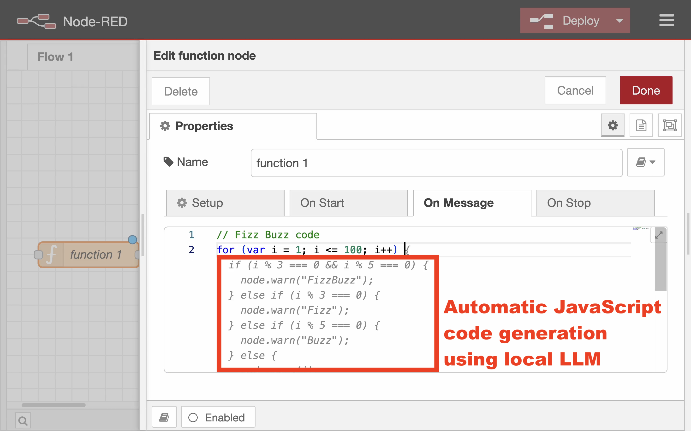

# node-red-contrib-plugin-codecompletion

Code completion plugin for Node-RED's function nodes

This plugin enables the code completion on code editor of function node.
While typing code, editor automatically suggests the code based on the existing code.
By just pushing tab key, user can accept and insert the suggested code.



Because this plugin uses Ollama, users need to install it in advance.

- Linux
  Execute the following command on the terminal.
  ```
  
  ```

- Windows and macOS
  You can use installer to setup Ollama environment.
